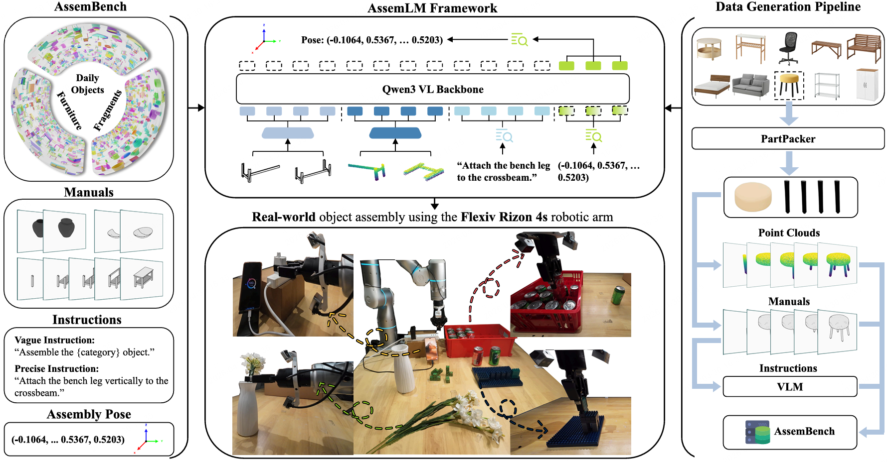
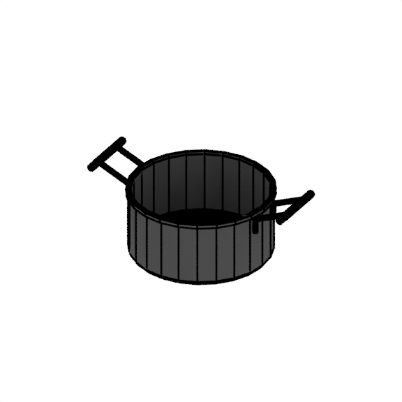
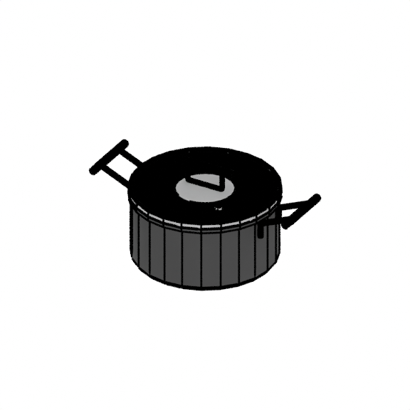
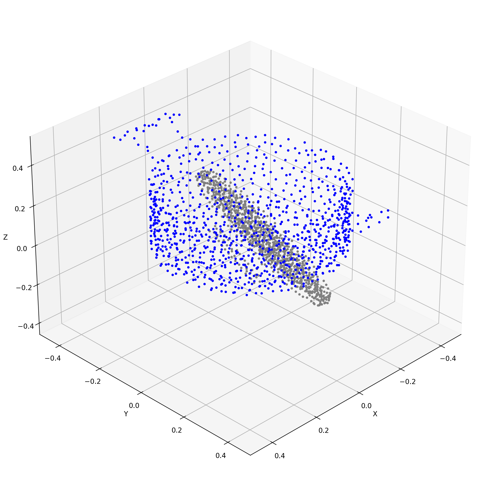
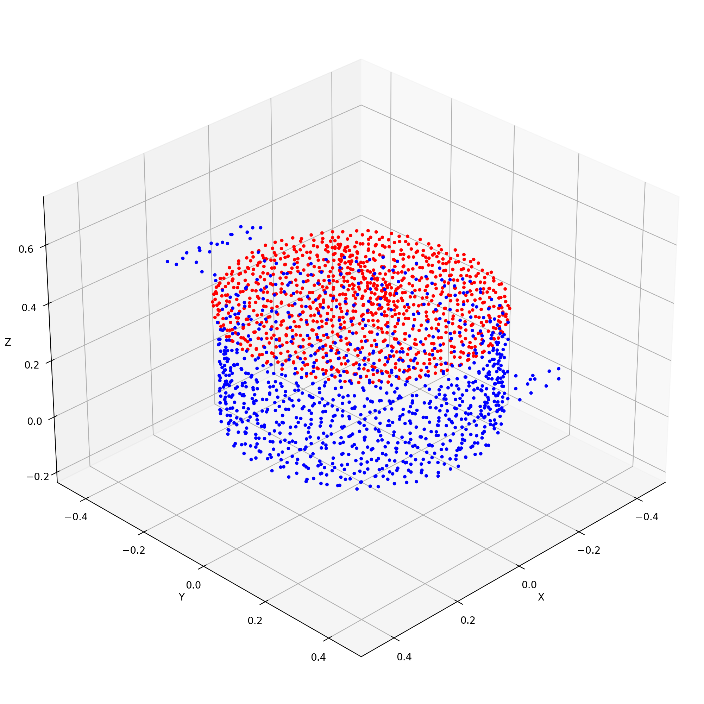

# 🏗️ **AssemLM: Spatial Reasoning Multimodal Large Language Models for Robotic Assembly**

<div align="center">

[Zhi Jing](https://scholar.google.com/citations?user=dlbY-nkAAAAJ&hl=zh-CN)<sup>1,2</sup>, [Jinbin Qiao](https://scholar.google.com/citations?user=L3_Wl_0AAAAJ&hl=zh-CN)<sup>2,3</sup>, [Ouyang Lu](https://scholar.google.com/citations?user=QXCaKP4AAAAJ&hl=zh-CN)<sup>2,4</sup>, [Jicong Ao](https://scholar.google.com/citations?user=AA4WipQAAAAJ&hl=en)<sup>2</sup>, [Shuang Qiu](https://www.cityu.edu.hk/stfprofile/shuanqiu.htm)<sup>5</sup>, [Yu-Gang Jiang](https://scholar.google.com/citations?user=f3_FP8AAAAAJ&hl=en)<sup>1,\*</sup>, [Chenjia Bai](https://baichenjia.github.io/)<sup>2,\*</sup>

<sup>1</sup>Fudan University<sup>†</sup>, <sup>2</sup>Institute of Artificial Intelligence (TeleAI), China Telecom<sup>†</sup>,

<sup>3</sup>Tianjin University, <sup>4</sup>Northwestern Polytechnical University, <sup>5</sup>City University of Hong Kong

<sup>\*</sup> Equal advising | <sup>†</sup> Equally leading organizations

<p align="center">
  <a href="https://arxiv.org/pdf/2604.08983"></a>
  <a href="https://arxiv.org/abs/2604.08983"></a>
  <a href="https://huggingface.co/TeleEmbodied/AssemLM-V1/tree/main"></a>
  <a href="https://huggingface.co/datasets/TeleEmbodied/AssemLM/tree/main"></a>
  <a href="https://assemlmhome.github.io/"></a>
  <a href="https://github.com/TeleHuman/AssemLM"></a>
</p>

</div>



## 🚀 News

- **[2026-04-29]** 🔓 Open-source the inference code, AssemLM-V1 weights, and demo dataset for inference.
- **[2026-04-16]** 🗺️ Announce the open-source plan.
- **[2026-04-10]** 📄 Upload the paper to arXiv: [paper](https://arxiv.org/abs/2604.08983)
- **[2026-03-15]** 🎉 Release the first version of the [project page](https://assemlmhome.github.io/).
- **[2026-03-05]** 🏗️ Create the [project page](https://assemlmhome.github.io/) and [code repository](https://github.com/TeleHuman/AssemLM).

## ⚙️ Setup Environment

### Installation Steps

#### 1. Clone the repository

```sh
git clone https://github.com/TeleHuman/AssemLM.git
cd AssemLM
```

#### 2. Create & Build conda env

```sh
conda create -n assemlm python=3.10.14 -y
conda activate assemlm
bash setting.sh
```

#### 3. Prepare the model

```sh
mkdir models && cd models
huggingface-cli download TeleEmbodied/AssemLM-V1 --local-dir ./AssemLM-V1
```

#### 3. Prepare the dataset

```sh
mkdir datasets && cd datasets
huggingface-cli download --repo-type dataset --resume-download TeleEmbodied/AssemLM  --local-dir .
cd ..
```

## 🚀 **Getting Started**

1. Run the API server for AssemLM.

```sh
bash scripts/run_api.sh
```

2. Open another terminal and run the query code:

```sh
conda activate assemlm
bash scripts/query_assemlm.sh
```

After running, two folders will be created in the root directory:

- `datasets_tmp`: contains the input data for the current request.
- `results_tmp`: contains the prediction results and visualization outputs.

<p align="center">
  
  
  
  
</p>

<p align="center">
  The first three images are from <code>datasets_tmp</code>, while the last image is from <code>results_tmp</code>.
</p>

## 🗺️ Open-Source Plan

- [x] 🔓 Release **AssemLM-V1 weights**, **inference code**, and a **demo dataset**.
- [ ] 📦 Release the **majority of the AssemBench dataset**.
- [ ] 📚 Release **additional datasets and benchmark resources**.
- [ ] 🧠 Release the **training code**.
- [ ] ⚙️ Release the **data processing pipeline**.
- [ ] 🚀 Release **updated and improved model weights**.

## 🔖 Citation

If you find our work helpful, please cite:

```bibtex
@article{jing2026assemlm,
  title={AssemLM: Spatial Reasoning Multimodal Large Language Models for Robotic Assembly},
  author={Jing, Zhi and Qiao, Jinbin and Lu, Ouyang and Ao, Jicong and Qiu, Shuang and Jiang, Yu-Gang and Bai, Chenjia},
  journal={arXiv preprint arXiv:2604.08983},
  year={2026}
}
```

## Acknowledgements

- Our implementation is based on the open-source codebases from [StarVLA](https://github.com/starVLA/starVLA), [TwoByTwo](https://github.com/TEA-Lab/TwoByTWo), [RoboRefer](https://github.com/zhoues/RoboRefer).
- We also sincerely acknowledge the datasets and assets provided by [PartNet](https://github.com/daerduoCarey/partnet_dataset), [BiAssembly](https://github.com/sxy7147/BiAssembly), [TwoByTwo](https://github.com/TEA-Lab/TwoByTWo), [PartNeXt](https://github.com/AuthorityWang/PartNeXt), [IKEA-Manual](https://cs.stanford.edu/~rcwang/projects/ikea_manual/).
