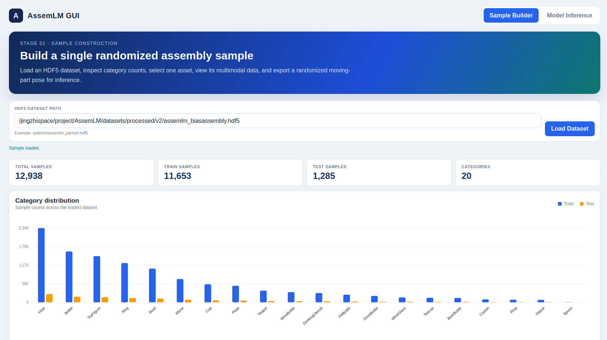
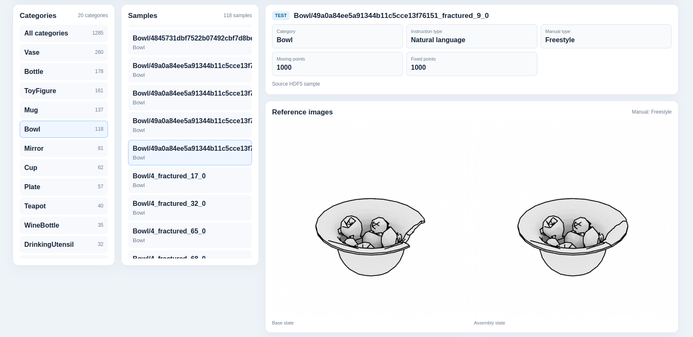
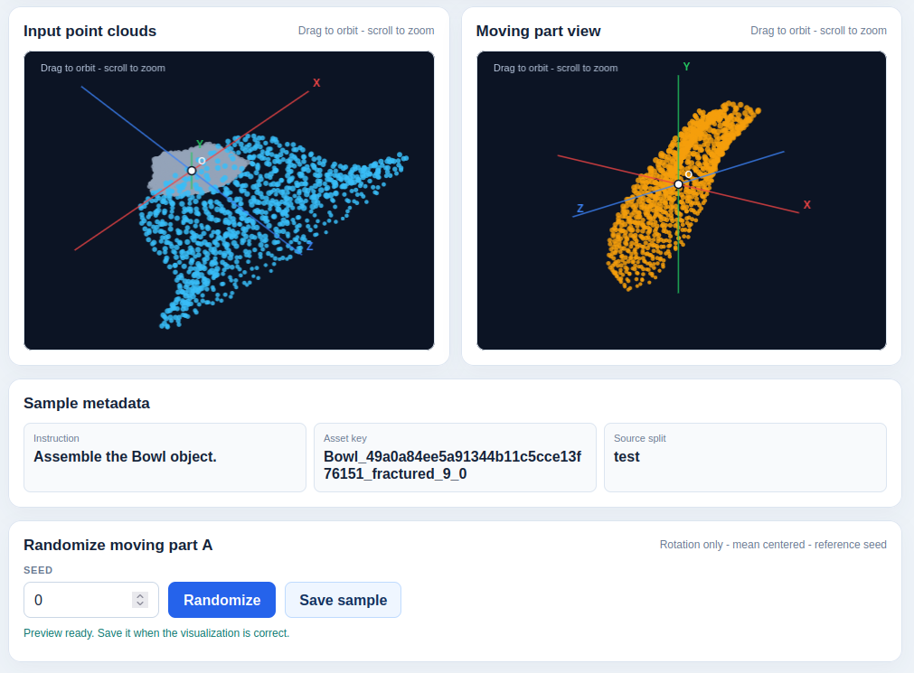
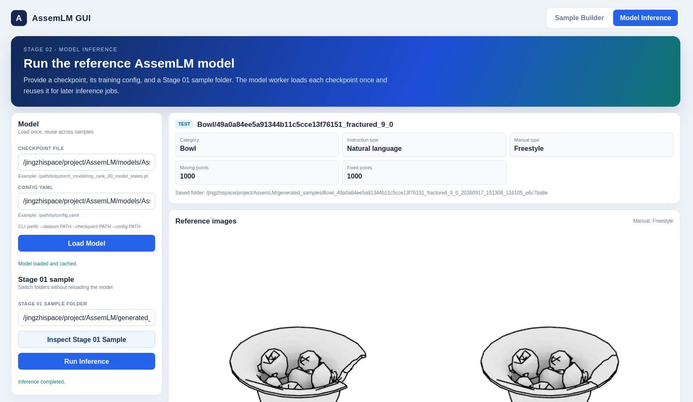
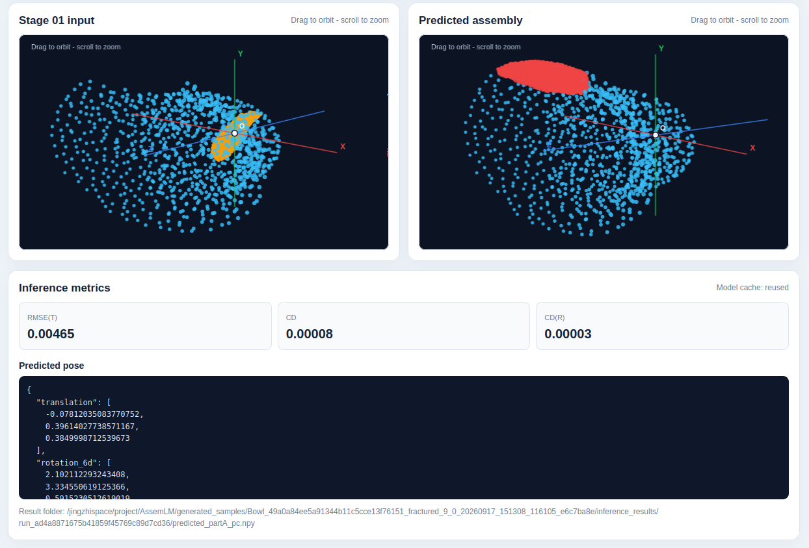

<p align="center">
  
</p>

# 🏗️ **AssemLM: A Spatial Reasoning Multimodal Large Language Model for Robotic Assembly**

<div align="center">

[Zhi Jing](https://scholar.google.com/citations?user=dlbY-nkAAAAJ&hl=zh-CN)<sup>1,2</sup>, [Jinbin Qiao](https://scholar.google.com/citations?user=L3_Wl_0AAAAJ&hl=zh-CN)<sup>2,3</sup>, [Ouyang Lu](https://scholar.google.com/citations?user=QXCaKP4AAAAJ&hl=zh-CN)<sup>2,4</sup>, [Jicong Ao](https://scholar.google.com/citations?user=AA4WipQAAAAJ&hl=en)<sup>2</sup>, [Shuang Qiu](https://www.cityu.edu.hk/stfprofile/shuanqiu.htm)<sup>6</sup>, [Huazhe Xu](https://hxu.rocks/)<sup>5</sup>, [Yu-Gang Jiang](https://scholar.google.com/citations?user=f3_FP8AAAAAJ&hl=en)<sup>1,\*</sup>, [Chenjia Bai](https://baichenjia.github.io/)<sup>2,\*</sup>

<sup>1</sup>Fudan University<sup>†</sup>, <sup>2</sup>Institute of Artificial Intelligence (TeleAI), China Telecom<sup>†</sup>,

<sup>3</sup>Tianjin University, <sup>4</sup>Northwestern Polytechnical University, <sup>5</sup>Tsinghua University, <sup>6</sup>City University of Hong Kong

<sup>\*</sup> Equal advising | <sup>†</sup> Equally leading organizations

<p align="center">
  <a href="https://arxiv.org/pdf/2604.08983"></a>
  <a href="https://arxiv.org/abs/2604.08983"></a>
  <a href="https://huggingface.co/TeleEmbodied/AssemLM2.0"></a>
  <a href="https://huggingface.co/datasets/TeleEmbodied/AssemLM2.0_Datasets"></a>
  <a href="https://assemlmhome.github.io/"></a>
  <a href="https://github.com/TeleHuman/AssemLM"></a>
</p>

</div>

## 🚀 News

- **[Coming soon]** 📄 The **AssemLM 2.0 report** is coming soon.
- **[2026-09-14]** 🎉 Release **AssemLM 2.0**: the training/evaluation code, the **AssemLM 2.0 checkpoint**, and the **AssemLM 2.0 datasets** are all published. 🤖 **AssemLM-Anything** is coming soon — stay tuned!
- **[2026-09-05]** 🎊 **AssemLM is accepted to CoRL 2026.**
- **[2026-04-29]** 🔓 Open-source the inference code, AssemLM-V1 weights, and demo dataset for inference.
- **[2026-04-16]** 🗺️ Announce the open-source plan.
- **[2026-04-10]** 📄 Upload the paper to arXiv: [paper](https://arxiv.org/abs/2604.08983)
- **[2026-03-15]** 🎉 Release the first version of the [project page](https://assemlmhome.github.io/).
- **[2026-03-05]** 🏗️ Create the [project page](https://assemlmhome.github.io/) and [code repository](https://github.com/TeleHuman/AssemLM).

## 📁 Repository Layout

```text
AssemLM/
├── assemlm/            # AssemLM 2.0 package
│   ├── dataloader/     # HDF5 datasets and collators
│   ├── eval/           # evaluation and aggregation entry points
│   ├── model/          # AssemLM2, PVLM, point encoder, point projector
│   ├── training/       # training loop and trainer utilities
│   ├── utils/          # shared geometry helpers
│   └── legacy/v1/      # archived original AssemLM-V1 implementation
├── main/               # query client and the GUI inference worker
├── config/             # OmegaConf training config and DeepSpeed launch settings
├── scripts/            # GUI, training, and evaluation launchers
├── datasets/           # local datasets (downloaded, ignored by git)
└── models/             # local model assets (downloaded, ignored by git)
```

## ⚙️ Setup Environment

### 1. Clone the repository

```sh
git clone https://github.com/TeleHuman/AssemLM.git
cd AssemLM
```

### 2. Create & build the conda environment

```sh
conda create -n assemlm python=3.10.14 -y
conda activate assemlm
bash setting.sh
```

`setting.sh` installs the package in editable mode (`pip install -e .`) plus the
tested dependency set from [`requirements_assemlm_v2.txt`](requirements_assemlm_v2.txt)
(`torch 2.5.1`, `transformers 4.57.0`, `deepspeed 0.16.9`, `accelerate 1.5.2`,
`h5py`, `trimesh`, ...).

The installer keeps **eager attention** as the portable default and avoids
hard-coding a CUDA/PyTorch-specific FlashAttention wheel. Set
`INSTALL_FLASH_ATTENTION=true` only on machines where a compatible
FlashAttention build is available. Note that the release's custom point-cloud
attention mask requires `attn_implementation: eager`.

After installation the console commands `assemlm-gui`, `assemlm-eval`,
`assemlm-aggregate-eval`, and `assemlm-aggregate-seeds` are available in the
active environment; the distributed shell launchers stay under `scripts/`.

## 📦 Model Download

```sh
mkdir -p models && cd models

# AssemLM 2.0 checkpoint + config
hf download TeleEmbodied/AssemLM2.0 --local-dir ./AssemLM2

# Base vision-language model used by the configuration
hf download Qwen/Qwen3-VL-2B-Instruct --local-dir ./Qwen3-VL-2B-Instruct

cd ..
```

The released checkpoint is `epoch_0215_steps_2111515`:

| Item | Value |
|---|---|
| Checkpoint | `models/AssemLM2/epoch_0215_steps_2111515/pytorch_model/mp_rank_00_model_states.pt` |
| Config | `models/AssemLM2/config.yaml` |
| Recorded epoch / step | `215` / `2,111,515` |
| Parameters | ≈ `2.24 B` (Qwen3-VL-2B backbone + 113 M assembly modules) |
| Size | `4,482,346,012` bytes (≈ `4.17 GiB`) |
| SHA-256 | `ae2030284436e500ff090ccebb9c6135493c7ddc6f522d3ce03125d3f72aa9fc` |

Point the release at the downloaded assets:

```sh
export ASSEMLM_VLM_PATH=$PWD/models/Qwen3-VL-2B-Instruct
export CONFIG_PATH=$PWD/models/AssemLM2/config.yaml
export CHECKPOINT_PATH=$PWD/models/AssemLM2/epoch_0215_steps_2111515/pytorch_model/mp_rank_00_model_states.pt
```

## 📚 Dataset Download

```sh
mkdir -p datasets && cd datasets
hf download TeleEmbodied/AssemLM2.0_Datasets --repo-type dataset --local-dir ./AssemLM2
cd ..
```

| File | Train | Test | Total | Manual images | Size |
|---|---:|---:|---:|---|---:|
| `assemlm_biasassembly.hdf5` | 11,653 | 1,285 | 12,938 | Freestyle | 4.33 GiB |
| `assemlm_ikea.hdf5` | 0 | 652 | 652 | Freestyle | 0.20 GiB |
| `assemlm_partnet.hdf5` | 51,155 | 12,897 | 64,052 | Freestyle | 8.45 GiB |
| `assemlm_partnext.hdf5` | 54,743 | 2,980 | 57,723 | Freestyle | 5.59 GiB |
| `assemlm_twobytwo.hdf5` | 301 | 140 | 441 | Lineart | 0.12 GiB |

The repository also ships two auxiliary artifacts that are **not** needed for
training or evaluation:

- `preview/`: small image-based previews (20 samples per split) used by the
  Hugging Face Dataset Viewer;
- `sub500/`: 500/500 train/test subsets of the three largest datasets, provided
  so the GUI loads them within seconds.

Every HDF5 sample stores two point clouds (`partA-pc`, `base_partB-pc`), two
manual images (`image_base_<manual>`, `image_assemble_<manual>`) and the object
`category`. Training and evaluation discover every `assemlm_*.hdf5` file below
`ASSEMLM_DATA_ROOT`, which defaults to `<repository>/datasets/AssemLM2` — the
layout produced by the download command above, so the export is only needed when
the datasets live somewhere else:

```sh
export ASSEMLM_DATA_ROOT=$PWD/datasets/AssemLM2
```

## 🖥️ GUI Usage

**Sample construction**

<table>
  <tr>
    <td width="33%" align="center" valign="top">
      <a href="assets/gui1.png"></a>
      <br><sub>1. Dataset overview</sub>
    </td>
    <td width="33%" align="center" valign="top">
      <a href="assets/gui2.png"></a>
      <br><sub>2. Sample selection</sub>
    </td>
    <td width="33%" align="center" valign="top">
      <a href="assets/gui3.png"></a>
      <br><sub>3. Point cloud preview</sub>
    </td>
  </tr>
</table>

**Model inference**

<table>
  <tr>
    <td width="50%" align="center" valign="top">
      <a href="assets/gui4.png"></a>
      <br><sub>4. Run model inference</sub>
    </td>
    <td width="50%" align="center" valign="top">
      <a href="assets/gui5.png"></a>
      <br><sub>5. Assembly and metrics</sub>
    </td>
  </tr>
</table>

Click any screenshot to view it at full resolution.

The GUI builds randomized single-sample folders from an HDF5 file and runs
cached model inference on them:

```sh
export ASSEMLM_VLM_PATH=$PWD/models/Qwen3-VL-2B-Instruct

ASSEMLM_GUI_PYTHON=python python scripts/AssemLM_GUI.py \
  --host 0.0.0.0 \
  --port 7860 \
  --dataset "$ASSEMLM_DATA_ROOT/assemlm_partnet.hdf5" \
  --checkpoint "$CHECKPOINT_PATH" \
  --config "$CONFIG_PATH"
```

Then open `http://127.0.0.1:7860` in a browser. Notes:

- Use one of the `sub500/*.hdf5` files instead of the full dataset when you only
  want interactive browsing — they load much faster.
- `ASSEMLM_GUI_PYTHON` selects the interpreter used for the inference worker; the
  worker needs the dependencies from `requirements_assemlm_v2.txt`.
- Each run's PID, application log, and inference-worker log are written to a
  timestamped directory under `logs/`. Set `ASSEMLM_PROJECT_ROOT` when launching
  the GUI outside a source checkout.
- The worker caches the loaded model and reloads it automatically if the config
  or checkpoint changes. `ASSEMLM_GUI_WORKER_TIMEOUT_SECONDS` (default `1800`)
  controls the per-request timeout; `0` disables it.
- The GUI reports `RMSE(T)`, `CD`, and `CD(R)`.

## 🧪 Model Evaluation

Set the required paths and run the multi-dataset evaluation launcher:

```sh
export ASSEMLM_VLM_PATH=$PWD/models/Qwen3-VL-2B-Instruct
export CONFIG_PATH=$PWD/models/AssemLM2/config.yaml
export CHECKPOINT_PATH=$PWD/models/AssemLM2/epoch_0215_steps_2111515/pytorch_model/mp_rank_00_model_states.pt
export ASSEMLM_DATA_ROOT=$PWD/datasets/AssemLM2

export GPU_IDS=0                       # e.g. 0,1,2,3 for multi-GPU evaluation
export EVAL_SEEDS_CSV=0                # e.g. 0,1,2,3,4,5,6,7,8,9
export EVAL_DATASETS_CSV=partnet       # e.g. biasassembly,ikea,partnet,twobytwo
export OUTPUT_ROOT=$PWD/eval_results

bash scripts/eval_assemlm_v2_seed0_9.sh
```

Useful optional variables:

| Variable | Default | Meaning |
|---|---|---|
| `TRAIN_NUM_SAMPLES` | `100` | train-split samples per dataset |
| `TEST_NUM_SAMPLES` | `200` | test-split samples for datasets without a dedicated override |
| `PARTNET_TEST_NUM_SAMPLES` | `1000` | test samples for PartNet |
| `BIASSEMBLY_TEST_NUM_SAMPLES` | `1300` | test samples for BiasAssembly |
| `RUN_TIMESTAMP` | current time | name of the output run directory |
| `ASSEMLM_PYTHON` / `ASSEMLM_ACCELERATE` | `python` / `accelerate` | interpreter and launcher |
| `DRY_RUN` | `false` | print the commands without running them |

`assemlm_ikea.hdf5` and `assemlm_twobytwo.hdf5` always evaluate their full test
split. Results are written to
`<OUTPUT_ROOT>/<checkpoint>/<RUN_TIMESTAMP>/<dataset>/seed_<N>/<split>/` together
with per-seed aggregates; `assemlm-aggregate-eval` and `assemlm-aggregate-seeds`
produce the cross-dataset and cross-seed mean/variance tables.

Reported metrics:

| Metric | Meaning |
|---|---|
| `Avg GD` | mean geodesic rotation error |
| `RMSE(T)` | translation RMSE |
| `CD` | one half of the symmetric Chamfer distance |
| `PA(0.01)` / `PA(0.008)` / `PA(0.005)` | part accuracy for `CD < 0.01` / `0.008` / `0.005` |
| `CD(R)` | translation-corrected Chamfer distance (also halved) |

## 🏋️ Model Training

```sh
export ASSEMLM_VLM_PATH=$PWD/models/Qwen3-VL-2B-Instruct
export ASSEMLM_DATA_ROOT=$PWD/datasets/AssemLM2

export GPU_IDS=0,1,2,3     # one or more GPUs
export RUN_ID=assemlm_v2
export RUN_ROOT_DIR=$PWD/results
export SEED=42

bash scripts/train_assemlm_v2.sh
```

- Training reads [`config/assemlm_v2.yaml`](config/assemlm_v2.yaml) and starts
  from a newly initialized `AssemLM2` model.
- `GPU_IDS=0` uses `config/deepspeed_zero2_1gpu.yaml`; multiple GPU ids use
  `config/deepspeed_zero2.yaml` with `accelerate launch`.
- Training uses the four collection datasets
  (`biasassembly+partnet+partnext+twobytwo`) and evaluates on `twobytwo` while
  training; set `datasets.assemble_data.train_mix` / `test_mix` in
  [`config/assemlm_v2.yaml`](config/assemlm_v2.yaml) to other `+`-separated
  dataset names (`ikea`, `partnet`, ...) or `auto` for every `assemlm_*.hdf5`
  file below `ASSEMLM_DATA_ROOT`.
- `WANDB_MODE` defaults to `offline`; set `WANDB_MODE=online` (and
  `wandb login`) to stream logs.
- `RUN_ROOT_DIR/RUN_ID` must not exist yet, and `DRY_RUN=true` prints the exact
  training command without starting it.

## 🗺️ Open-Source Plan

- [x] 🔓 Release **AssemLM-V1 weights**, **inference code**, and a **demo dataset**.
- [x] 🧠 Release the **AssemLM 2.0 training code**.
- [x] 🚀 Release the **AssemLM 2.0 weights** and the **AssemLM 2.0 datasets**.
- [ ] 📚 Release **additional datasets and benchmark resources**.
- [ ] ⚙️ Release the **data processing pipeline**.
- [ ] 🤖 Release **AssemLM-Anything**.

## 🔖 Citation

If you find our work helpful, please cite:

```bibtex
@article{jing2026assemlm,
  title={AssemLM: A Spatial Reasoning Multimodal Large Language Model for Robotic Assembly},
  author={Jing, Zhi and Qiao, Jinbin and Lu, Ouyang and Ao, Jicong and Qiu, Shuang and Xu, Huazhe and Jiang, Yu-Gang and Bai, Chenjia},
  journal={arXiv preprint arXiv:2604.08983},
  year={2026}
}
```

## 🤝 Collaborators

We thank the following collaborators for their contributions to this work:

- [Yuhan Gao](https://github.com/gyh-cookie)

## Acknowledgements

- Our implementation is based on the open-source codebases from [StarVLA](https://github.com/starVLA/starVLA), [TwoByTwo](https://github.com/TEA-Lab/TwoByTWo), [RoboRefer](https://github.com/zhoues/RoboRefer).
- We also sincerely acknowledge the datasets and assets provided by [PartNet](https://github.com/daerduoCarey/partnet_dataset), [BiAssembly](https://github.com/sxy7147/BiAssembly), [TwoByTwo](https://github.com/TEA-Lab/TwoByTWo), [PartNeXt](https://github.com/AuthorityWang/PartNeXt), [IKEA-Manual](https://cs.stanford.edu/~rcwang/projects/ikea_manual/).
- We thank the authors of Manual-PA and Manual2Skill for their research on understanding assembly manuals and 3D part assembly.

Third-party code that is bundled with or adapted into this repository
(ChamferDistancePytorch, the Vector Neuron / VN-DGCNN point encoder, StarVLA,
OpenVLA, X-VLA, and the Qwen3-VL-2B-Instruct backbone) is listed together with
its license in [`THIRD_PARTY_NOTICES.md`](THIRD_PARTY_NOTICES.md).
